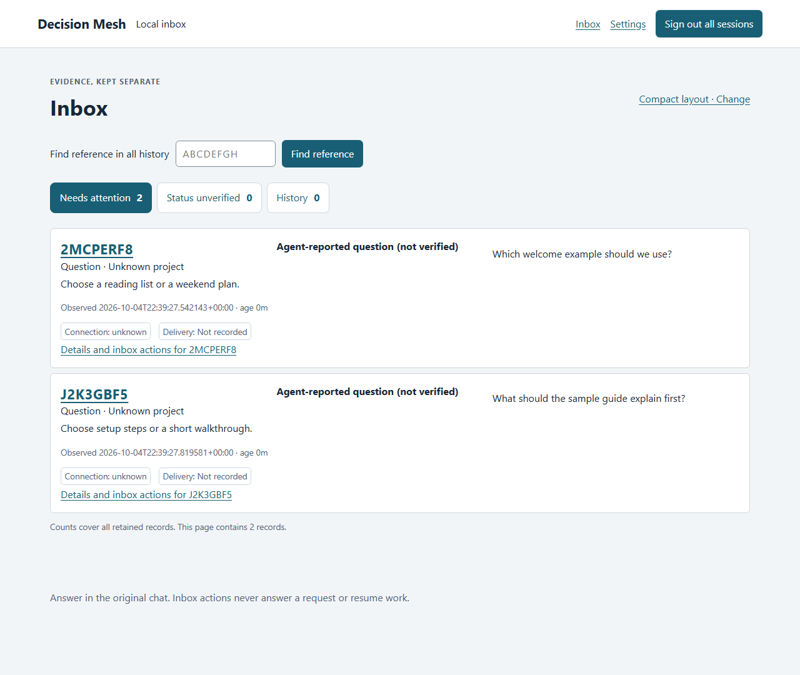
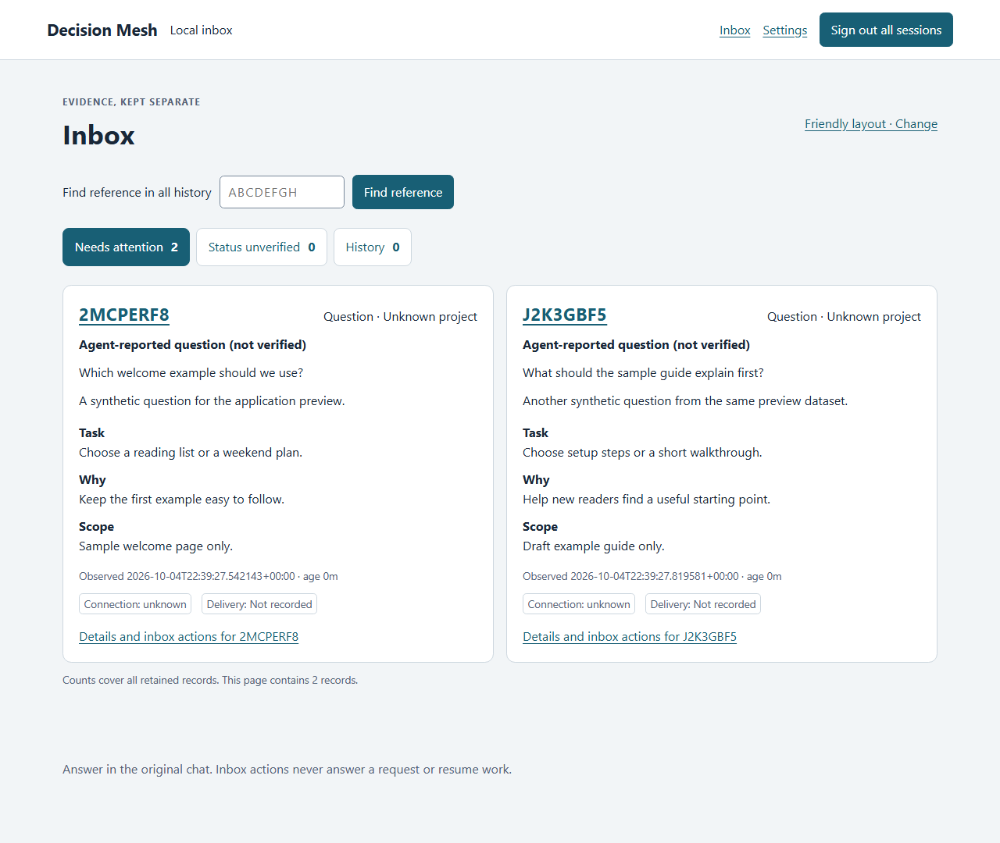

# Application alpha preview

Decision Mesh provides a local inbox for agent-reported questions and observations. These screenshots show the implemented **application alpha** with two wholly synthetic agent-reported observations. They are actual captures of the authenticated local application, using its explicit producer and disposable data.

The screenshots demonstrate the local interface. They do not establish qualified native prompts, native request lifecycle support, live Telegram delivery, or stable release readiness.

## Compact

Compact uses rows for quick scanning: reference, question, evidence label, short task, observation time, connection state and delivery state.

## Friendly

Friendly shows the same records as cards, with a summary and Task, Why and Scope blocks. Changing layout does not change a question's evidence or answer it.

## Reading the preview

- **Agent-reported question (not verified)** identifies the evidence available. It does not establish that a native prompt is currently waiting.
- **Connection: unknown** and **Delivery: Not recorded** are separate facts. This capture used local-only mode and sent no Telegram messages.
- **Unknown project** means no project identity was supplied for these examples. The eight-character references locate records; they are not authorization tokens.
- **Needs attention** is an inbox view. Seen and snooze actions affect inbox visibility or notifications; they never answer a request or resume work. An empty inbox does not prove that an agent is unblocked.

There are no remote approval buttons. Answer in the original chat, where native permissions remain in force. Native lifecycle, opted-in recipient and operational qualification remain separate release requirements.

Captured on 5 October 2026 (local date), in headless Chromium, at 1280 × 1080. Only application viewport pixels are shown; no browser profile, address bar, real records or credentials appear. The images are unretouched captures of one synthetic dataset.

See the [alpha quickstart](quickstart.md) for the supported local workflow and the [agent skill guide](agent-skill.md) for advisory producer use. These preview images are examples, not an installation or native-host qualification report.
